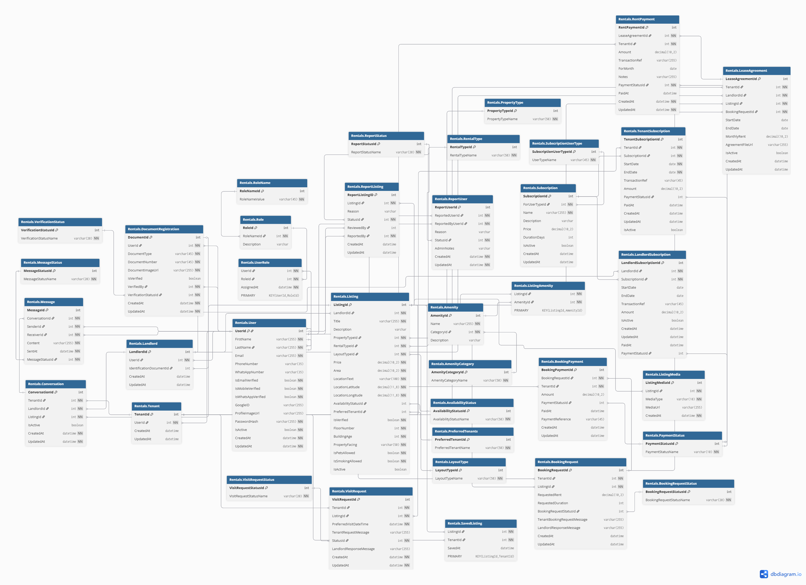

# RoomRental Application

## Project Overview

RoomRental is a comprehensive platform designed to streamline the process of finding and renting rooms/properties. It connects tenants seeking accommodation with landlords offering properties, featuring robust tools for listing, searching, communication, and payment management.

For a quick visual overview of the database structure:

**Click for Detailed ERD (SVG)**: You can view a high-resolution, zoomable version of the ERD by clicking [here](images/Rentals_SVG.svg).

---

## Features

The RoomRental application offers a diverse set of features catering to different user roles:

### Common Features

* **User Authentication**: Register and sign in using email, Google, or WhatsApp.
* **Account Management**: Ability to change and modify all account-related settings.
* **Security**: Password reset and account recovery functionalities.
* **Reporting**: Flagging fake listings and reporting malicious users to maintain platform integrity.

### Tenant Features

Tenants can efficiently find and manage their rental properties with features like:

* **Advanced Search & Filter**:
    * **Location**: Search by exact location (integrates with mapping APIs like Google Maps).
    * **Property Type**: Filter by Residential (Flat, House, Business, Office Space, Apartment, Single Room, Hostel/PG) or Commercial (Flat, House, Business, Office Space).
    * **Layout Type**: Search for 1RK, 1BHK, 2BHK, 3BHK, 4BHK, 4+BHK, Studio.
    * **Price**: Filter within a specified price range.
    * **Availability**: Filter by immediate, within 15 days, within 30 days, or 30+ days.
    * **Preferred Tenant**: Search for properties preferring Families, Bachelor Male, Bachelor Female, Company, or Friends.
    * **Amenities**: Detailed filtering options including:
        * **Room Amenities**: Furnishings (Furnished, Partial-Furnished, Not Furnished), Air Condition, Heater, Hot Water (Geyser/Solar), Kitchen Equipment (Cooking), Fridge, Wi-Fi, Power Backup, Attached Bathroom, Balcony.
        * **Property Amenities**: CCTV, Security, Bike Parking, Car Parking, Drainage, Waste Disposal, Drinking Water, 24x7 Water (Boring, Well, Municipal, Tanker), Accessibility.
    * **Property Rules**: Filter by "Pets Allowed?" and "Smoking Allowed?".
    * **Verification Status**: Filter for "Verified" properties.
* **Listing Details**: View comprehensive information for each listing, including:
    * Property Name/Title
    * Listing Price
    * Verified Location (integrated with Google Maps)
    * Property Area
    * Room Layout Type
    * Video and Images
    * Preferred Tenant
    * Amenities
    * Description
    * Other Details: Floor in building, Age of Building, Property Facing.
* **Engagement**:
    * **Shortlist**: Like and save listings for later viewing.
    * **Communication**: Call and message landowners (chat-messaging), with verified contact number and email.
    * **Visit Scheduling**: Schedule property visits, subject to landlord approval.
    * **Online Booking**: Book properties after landlord approval (integrates with payment gateways like Esewa). A lease agreement is generated post-booking.
* **Payments**: Ability to pay monthly rent directly from the application.
* **Dashboards**: Access various dashboards for tracking:
    * Appointment Dashboard
    * Booking Dashboard
    * Shortlist Dashboard
    * Monthly Rent Dashboard
* **Premium Benefits (Subscription)**: Tenants can pay a subscription fee for benefits like verified properties only and an ad-free experience.

### Landlord Features

Landlords can efficiently manage their properties and tenants with features like:

* **Landlord Registration**: Register as a landlord, providing:
    * Full Name
    * Phone Number (verified via OTP)
    * Email Address (verified)
    * Identifying Document (Citizenship, Passport, Driving License, PAN)
* **Listing Management**:
    * Draft and publish new property listings with detailed information:
        * Property Name (Title)
        * Location (integrated with Google Map)
        * Property Type (Residential, Commercial)
        * Types of Rental Properties (Flat, House, Business, Office Space, Apartment, Single Room, Hostel/PG)
        * Layout Type
        * Price
        * Photos (5 mandatory) and Video (mandatory)
        * Availability (Immediate, within 15 day, within 30 days, 30+ days)
        * Preferred Tenant
        * Amenities (Room and Property amenities as listed above)
* **Request Management**:
    * Approve property visit requests from tenants.
    * Approve tenants online and accept booking prices.
* **Dashboards**: Access owner-specific dashboards for tracking:
    * Appointments Dashboard
    * Booking Dashboard

### Admin Features

Admins are responsible for maintaining the platform's integrity and user experience:

* **Listing Management**: Edit and delete any listing.
* **Report Management**: View, approve, or deny reports for reported listings. Approving a report will delete the listing; denying it will keep the listing as is.
* **User Management**: Suspend, block, or delete user accounts.
* **Verification**: Review and approve account information, especially landlord identification documents.

---

## Database Schema

The application's data is structured within the `Rentals` schema, designed to support all the features and user roles described above.

* **Entity-Relationship Diagram (ERD)**: The overall structure and relationships between entities are visualized in the ERD provided.
* **Database Definition Language (DDL)**: The detailed table definitions, including columns, data types, primary keys, and foreign key constraints, are specified in the DDL script. This script sets up the `Rentals` schema and all its tables, including various lookup tables for maintaining data consistency (e.g., `PropertyType`, `RentalType`, `LayoutType`, `AvailabilityStatus`, `PreferredTenants`, `AmenityCategory`, `MessageStatus`, `VisitRequestStatus`, `BookingRequestStatus`, `PaymentStatus`, `ReportStatus`, `RoleName`, `SubscriptionUserType`).

* The application's data is meticulously structured within the `Rentals` schema, designed to support all the features and user roles. This database design adheres to **Third Normal Form (3NF)**, ensuring data integrity, minimizing redundancy, and optimizing for efficient data management.

### Key Database Components

The schema is logically organized into several areas, each addressing a core functional aspect of the RoomRental platform:

#### 1. Core User & Identity Management
* **`User`**: The central table for all application users (Tenants, Landlords, Admins). It stores fundamental user details like `FirstName`, `LastName`, `Email` (unique), `PhoneNumber`, `PasswordHash`, and `ProfileImageUrl`. Crucially, it includes `IsEmailVerified`, `IsMobileVerified` (both `BIT` type for boolean flags), the newly added `WhatsAppNumber` (unique and nullable for WhatsApp-specific communication), and `IsWhatsAppVerified` (also `BIT`). `GoogleID` is present for direct Google authentication linkage. Timestamps `CreatedAt` and `UpdatedAt` (both `DATETIME2`) ensure precise tracking of user record lifecycles.
* **`Tenant`**: Extends the `User` table for users acting as tenants, linking via `UserId`.
* **`Landlord`**: Extends the `User` table for users acting as landlords, linking via `UserId`. It includes `IdentificationDocumentId`, an optional foreign key to `DocumentRegistration`, acknowledging the need for landlord identity verification.
* **`DocumentRegistration`**: Manages identification documents uploaded by users (especially landlords). Stores `DocumentType`, `DocumentNumber`, `DocumentImageUrl`, `IsVerified` (BIT), and a `VerificationStatusId` (referencing `VerificationStatus` lookup) to track the state of document verification by admins.
* **`Role` & `UserRole`**: Implements a flexible role-based access control system. `Role` defines different application roles (e.g., Tenant, Landlord, Admin), while `UserRole` is a junction table linking users to their assigned roles.

#### 2. Property Listings & Amenities
* **`Listing`**: Represents a property available for rent. It's rich with details like `Title`, `Description` (VARCHAR(MAX) for extensive details), `Price`, `Area`, `Location` (with `LocationLatitude` and `LocationLongitude` for precise mapping), `FloorNumber`, `BuildingAge`, `PropertyFacing`, `IsPetsAllowed`, `IsSmokingAllowed`, and an `IsActive` flag. It extensively uses foreign keys to various lookup tables for standardized property attributes (e.g., `PropertyTypeId`, `RentalTypeId`, `LayoutTypeId`, `AvailabilityStatusId`, `PreferredTenantId`). An `IsVerified` (BIT) column denotes admin-approved listings.
* **`Amenity`**: Defines individual amenities (e.g., Wi-Fi, AC, Parking) with a `Name`, `Description`, and `CategoryId` (referencing `AmenityCategory` lookup) to group amenities.
* **`ListingAmenity`**: A junction table (`ListingId`, `AmenityId` as composite PK) to establish many-to-many relationships between `Listing` and `Amenity`, allowing properties to have multiple amenities.
* **`ListingMedia`**: Stores URLs for `MediaUrl` (images, videos) associated with a `Listing`, along with `MediaType` (Image/Video).

#### 3. Communication & Requests
* **`Conversation`**: Manages chat instances between `Tenant` and `Landlord` for a specific `Listing`.
* **`Message`**: Stores individual chat messages within a `Conversation`, including `SenderId`, `ReceiverId`, `Content`, `SentAt` (DATETIME2), and `MessageStatusId` (referencing `MessageStatus` lookup).
* **`VisitRequest`**: Records requests from `Tenant` to `Landlord` for property visits, including `PreferredVisitDateTime`, `TenantRequestMessage`, `StatusId` (referencing `VisitRequestStatus` lookup), and `LandlordResponseMessage`.
* **`BookingRequest`**: Manages formal booking requests for properties from `Tenant` to `Landlord`, capturing `RequestedRent`, `RequestedDuration`, and a `BookingRequestStatusId` (referencing `BookingRequestStatus` lookup).

#### 4. Booking, Lease & Payments
* **`LeaseAgreement`**: Stores details of executed lease agreements between `Tenant` and `Landlord` for a `Listing`, including `StartDate`, `EndDate`, `MonthlyRent`, `AgreementFileUrl`, and `IsActive` flag. Links directly to a `BookingRequestId`.
* **`BookingPayment`**: Records initial payments made for a `BookingRequest`, detailing `Amount`, `PaymentStatusId` (referencing `PaymentStatus` lookup), `PaidAt`, and `PaymentReference`.
* **`RentPayment`**: Tracks recurring monthly rent payments for a `LeaseAgreement`, including `Amount`, `TransactionRef`, `ForMonth`, `Notes`, `PaymentStatusId`, and `PaidAt`.

#### 5. Subscriptions
* **`Subscription`**: Defines different subscription plans available (e.g., Premium Tenant, Premium Landlord), including `Name`, `Description`, `Price`, `DurationDays`, `IsActive`, and `ForUserTypeId` (referencing `SubscriptionUserType` lookup).
* **`TenantSubscription`**: Records a tenant's enrollment in a `Subscription` plan, tracking `StartDate`, `EndDate`, `Amount`, `PaymentStatusId`, and `IsActive` status.
* **`LandlordSubscription`**: Similar to `TenantSubscription`, but for landlords.

#### 6. Reporting
* **`ReportListing`**: Stores reports made by users against specific `Listing` instances, including `Reason`, `StatusId` (referencing `ReportStatus` lookup), `ReportedBy` (UserId), and `ReviewedBy` (UserId).
* **`ReportUser`**: Stores reports made by users against other `User` accounts, including `ReportedUserId`, `ReportedByUserId`, `Reason`, `StatusId`, and `AdminNotes`.

#### 7. Lookup Tables for Normalized Data
A crucial aspect of this 3NF design is the extensive use of dedicated lookup tables (e.g., `PropertyType`, `RentalType`, `AvailabilityStatus`, `AmenityCategory`, `PaymentStatus`, `RoleName`, `SubscriptionUserType`, `ReportStatus`, `VerificationStatus`, `VisitRequestStatus`, `BookingRequestStatus`, `MessageStatus`). These tables:
* **Enforce Data Integrity**: By using foreign keys, they ensure that only valid, predefined values are entered into related transaction tables.
* **Improve Maintainability**: Adding, modifying, or deactivating options (e.g., a new `PropertyType`) becomes a simple data change in a lookup table, rather than requiring schema alterations and `CHECK` constraint updates across multiple tables.
* **Enhance Readability**: Queries become more explicit by joining to descriptive lookup tables rather than relying on cryptic codes or hardcoded strings.

---

## Usage (Conceptual)

Once the application is set up, users can:

* **Register/Login**: Create an account or sign in using their preferred method.
* **Browse Listings**: Tenants can explore properties using various search and filter options.
* **Create Listings**: Landlords can draft and publish their property listings.
* **Interact**: Tenants and landlords can communicate, schedule visits, and manage bookings and payments through the platform.
* **Admin Panel**: Admin users can access a dedicated interface for platform moderation and management.

---
